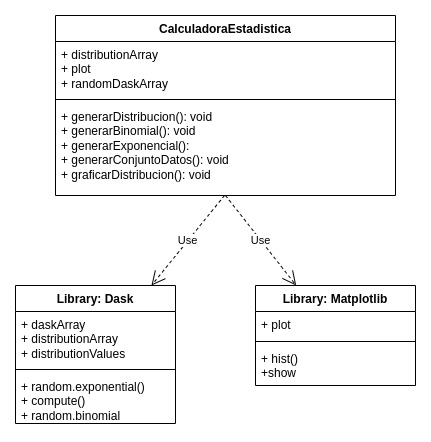

# Proyecto final: uso de Dask para análisis de datos

El presente proyecto tiene como fin demostrar la utilidad que posee la biblioteca de Dask en a la hora de crear sets de datos y generar distribuciones de probabilidad estudiadas ampliamente en el área estadística.
La librería de Dask permite generar grandes conjuntos de datos que podrían no caber en un computador. Al emplear paralelismo y concurrencia, es bastante apropiado para su implementación posterios en clusters.
Para permitir una mejor visualización, también se usará la biblioteca de Matplotlib para visualizar algunos de los resultados arrojados por Dask, con el fin de presentar los datos de manera más entendible e interactiva.

# Librerías usadas

* Dask 
* Matplotlib

# Comandos usados para las instalaciones de las librerías:

* pip install dask
* python3 -m pip install "dask[array]"
* python3 -m pip install -U matplotlib

# Manual de uso

En la sección pasada, se listan los comandos necesarios para instalar las librerías necesarias para ejecutar el proyecto. Ahora, para compilar y correr el programa puede hacer 
```
make 
```
lo cual ejecutará el programa. La estructura de datos por defecto consistirá de una matriz de 10000 x 10000 datos. Si gusta modificar el parámetro que controla el tamaño de la matriz, puede hacer

```
python3 main.py n
```
donde n correponde al número que se desea que tenga las diemensiones de la matriz.

Al correr el programa, Dask imprime, en el caso de que sea un número enorme, sólo una cantidad de los números generados aleatoriamente. Asimismo,también imprime el promedio de la cantidad de números.

En la segunda parte del código, se generan distribuciones de probabilidad, incluidas la exponencial y la binomial. El programa hace que Dask genere una distribución de cada tipo recibiendo los parámetros adecuados (por ejemplo, en el caso de la Binomial, la cantidad de pruebas o la probabilidad del éxito). Una vez que los datos han sido correctamente generados, se grafican mediante Matplotlib. Esta toma los datos de cada "arreglo", lo procesa y lo imprime en la pantalla.
# Diagrama

Un diagrama preliminar de la estructura se puede apreciar acá: 

